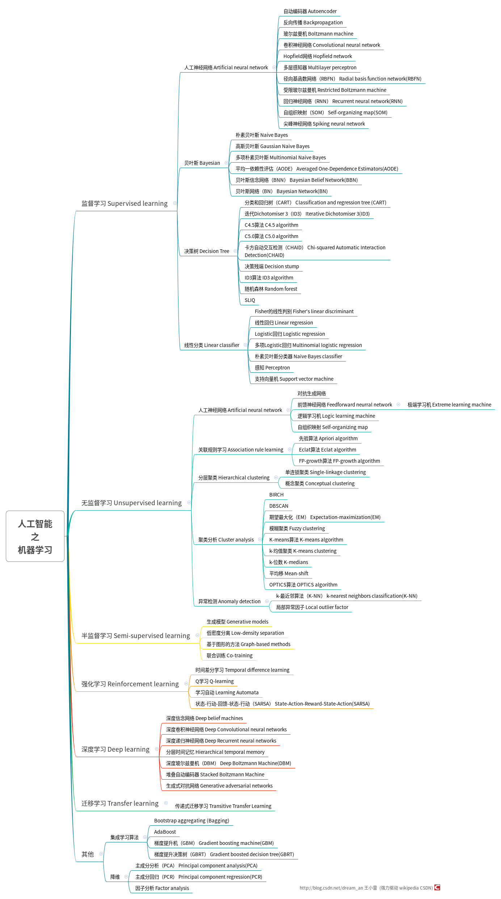
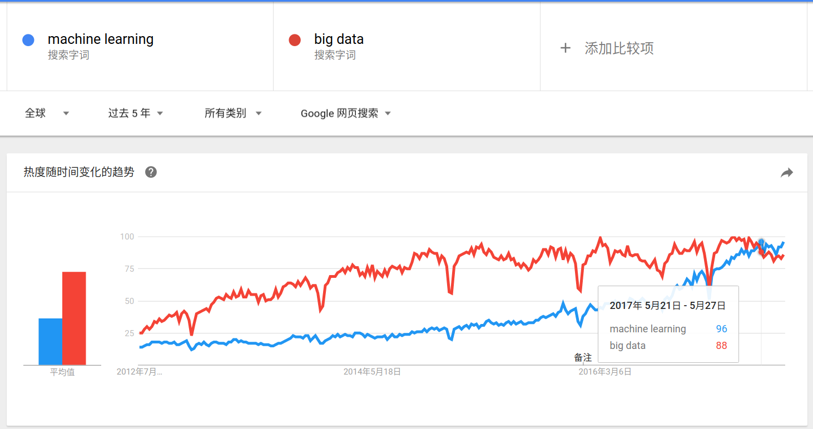
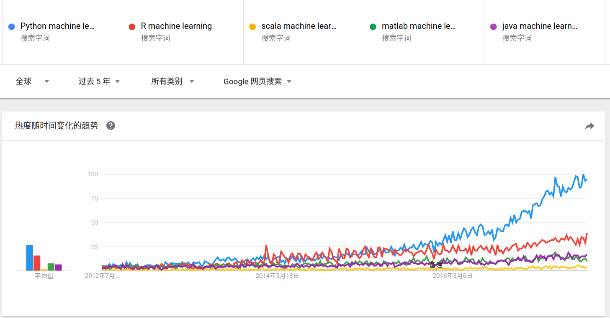
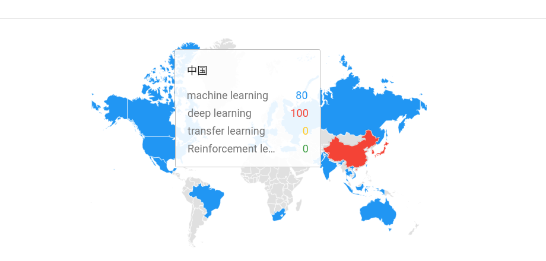

- [1.人工智能之机器学习体系汇总](#1.人工智能之机器学习体系汇总)
- [2.人工智能相关趋势分析](#2.人工智能相关趋势分析)
  - [2.1.人工智能再次登上历史舞台](#2.1.人工智能再次登上历史舞台)
  - [2.2.Python才是王道](#2.2.Python才是王道)
  - [2.3.深度学习趋势大热](#2.3.深度学习趋势大热)
  - [2.4.中国更爱深度学习](#2.4.中国更爱深度学习)
- [3.结语](#3.结语)

参加完2017CCAI，听完各位专家的演讲后受益匪浅。立志写“人工智能之机器学习”系列，此为开篇，主要梳理了机器学习方法体系，人工智能相关趋势，Python与机器学习，以及结尾的一点感恩。

>[Github开源机器学习系列文章及算法源码](https://github.com/wangxiaoleiAI/machine-learn[Github开源文章及算法源码](https://github.com/wangxiaoleiAI/machine-learning)ing)

1.人工智能之机器学习体系汇总
====
【直接上干货】此处梳理出面向人工智能的机器学习方法体系，主要体现机器学习方法和逻辑关系，理清机器学习脉络，后续文章会针对机器学习系列讲解算法原理和实战。抱着一颗严谨学习之心，有不当之处欢迎斧正。

- 监督学习 Supervised learning
	- 人工神经网络 Artificial neural network
		- 自动编码器 Autoencoder
		- 反向传播 Backpropagation
		- 玻尔兹曼机 Boltzmann machine
		- 卷积神经网络 Convolutional neural network
		- Hopfield网络 Hopfield network
		- 多层感知器 Multilayer perceptron
		- 径向基函数网络（RBFN） Radial basis function network(RBFN)
		- 受限玻尔兹曼机 Restricted Boltzmann machine
		- 回归神经网络（RNN） Recurrent neural network(RNN)
		- 自组织映射（SOM） Self-organizing map(SOM)
		- 尖峰神经网络 Spiking neural network
	- 贝叶斯 Bayesian
		- 朴素贝叶斯 Naive Bayes
		- 高斯贝叶斯 Gaussian Naive Bayes
		- 多项朴素贝叶斯 Multinomial Naive Bayes
		- 平均一依赖性评估（AODE） Averaged One-Dependence Estimators(AODE)
		- 贝叶斯信念网络（BNN） Bayesian Belief Network(BBN)
		- 贝叶斯网络（BN） Bayesian Network(BN)
	- 决策树 Decision Tree
		- 分类和回归树（CART） Classification and regression tree (CART)
		- 迭代Dichotomiser 3（ID3） Iterative Dichotomiser 3(ID3)
		- C4.5算法 C4.5 algorithm
		- C5.0算法 C5.0 algorithm
		- 卡方自动交互检测（CHAID） Chi-squared Automatic Interaction Detection(CHAID)
		- 决策残端 Decision stump
		- ID3算法 ID3 algorithm
		- 随机森林 Random forest
		- SLIQ
	- 线性分类 Linear classifier
		- Fisher的线性判别 Fisher's linear discriminant
		- 线性回归 Linear regression
		- Logistic回归 Logistic regression
		- 多项Logistic回归 Multinomial logistic regression
		- 朴素贝叶斯分类器 Naive Bayes classifier
		- 感知 Perceptron
		- 支持向量机 Support vector machine
- 无监督学习 Unsupervised learning
	- 人工神经网络 Artificial neural network
		- 对抗生成网络
		- 前馈神经网络 Feedforward neurral network
			- 极端学习机 Extreme learning machine
		- 逻辑学习机 Logic learning machine
		- 自组织映射 Self-organizing map
	- 关联规则学习 Association rule learning
		- 先验算法 Apriori algorithm
		- Eclat算法 Eclat algorithm
		- FP-growth算法 FP-growth algorithm
	- 分层聚类 Hierarchical clustering
		- 单连锁聚类 Single-linkage clustering
		- 概念聚类 Conceptual clustering
	- 聚类分析 Cluster analysis
		- BIRCH
		- DBSCAN
		- 期望最大化（EM） Expectation-maximization(EM)
		- 模糊聚类 Fuzzy clustering
		- K-means算法 K-means algorithm
		- k-均值聚类 K-means clustering
		- k-位数 K-medians
		- 平均移 Mean-shift
		- OPTICS算法 OPTICS algorithm
	- 异常检测 Anomaly detection
		- k-最近邻算法（K-NN） k-nearest neighbors classification(K-NN)
		- 局部异常因子 Local outlier factor
- 半监督学习 Semi-supervised learning
	- 生成模型 Generative models
	- 低密度分离 Low-density separation
	- 基于图形的方法 Graph-based methods
	- 联合训练 Co-training
- 强化学习 Reinforcement learning
	- 时间差分学习 Temporal difference learning
	- Q学习 Q-learning
	- 学习自动 Learning Automata
	- 状态-行动-回馈-状态-行动（SARSA） State-Action-Reward-State-Action(SARSA)
- 深度学习 Deep learning
	- 深度信念网络 Deep belief machines
	- 深度卷积神经网络 Deep Convolutional neural networks
	- 深度递归神经网络 Deep Recurrent neural networks
	- 分层时间记忆 Hierarchical temporal memory
	- 深度玻尔兹曼机（DBM） Deep Boltzmann Machine(DBM)
	- 堆叠自动编码器 Stacked Boltzmann Machine
	- 生成式对抗网络 Generative adversarial networks
- 迁移学习 Transfer learning
	- 传递式迁移学习 Transitive Transfer Learning
- 其他
	- 集成学习算法
		- Bootstrap aggregating (Bagging)
		- AdaBoost
		- 梯度提升机（GBM） Gradient boosting machine(GBM)
		- 梯度提升决策树（GBRT） Gradient boosted decision tree(GBRT)
	- 降维
		- 主成分分析（PCA） Principal component analysis(PCA)
		- 主成分回归（PCR） Principal component regression(PCR)
		- 因子分析 Factor analysis

>学习应当严谨，有不当场之处欢迎斧正。

>强力驱动 Wikipedia CSDN

2.人工智能相关趋势分析
===
2.1.人工智能再次登上历史舞台
-----------

人工智能与大数据对比——当今人工智能高于大数据

[数据来自Goolge trends]

2.2.Python才是王道
------------

[数据来自Google trends]
2.3.深度学习趋势大热
---------

[数据来自Google trends]
2.4.中国更爱深度学习
----------

[数据来源-Google trends]

3.结语
======
关于人工智能的一点感想，写在最后

> AI systems can’t model everything... AI needs to be robust to “unknown unknowns”  [Thomas G.Dietterich ,2017CCAI]

中国自古有之

>“知之为知之，不知为不知，是知也”【出自《论语》】

人工智能已然是历史的第三波浪潮，堪称“工业4.0”，有突破性的成就，但也有未解之谜。真正创造一个有认知力的“生命”——还有很大的难度。希望此次浪潮会持续下去，创造出其真正的价值，而非商业泡沫。

大多数的我们发表不了顶级学术论文，开创不了先河。不要紧，沉下心，努力去实践。

人工智能路漫漫，却让我们的生活充满了机遇与遐想。

>立志每周【周日】更新一篇“人工智能之机器学习”系列。[Github开源机器学习系列文章及算法源码](https://github.com/wangxiaoleiAI/machine-learning)

感谢CSDN的2017CCAI参会机遇与分享平台。
